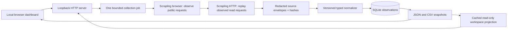

# CompSet Studio: local observation pipeline

The app is a local Python service with a browser dashboard at http://127.0.0.1:8765. It requires no LLM or paid API at runtime. Yellow is not a dependency.

## Components and contracts

- `collect.py`: input is an explicit listing/stay/guest/currency/calendar context; output is public response envelopes plus a transport report. Public read operations only; secrets stay in memory; bounded navigation, request count and timeouts. A missing endpoint is a coverage gap.
- `normalize.py`: input is those envelopes plus exact context; output is listing attributes, dated calendar observations, contextual stay quotes and warnings. Unknown fields stay unknown. False calendar booleans are distinct from absent fields. No booked-status inference.
- `pipeline.py`: immutable run evidence, idempotent SQLite ingestion, CSV/JSON exports and coverage calculation. Amounts use decimal strings/minor units. A total divided by nights is an effective average only.
- `server.py`: loopback-only local UI/API; one worker subprocess at a time; no shell execution, arbitrary URLs, booking writes or remote file access.
- `workspace.py`: read-only projection of saved hotel jobs, profile audits, Airbnb candidates/one-night evidence and BnBMe inventory. It validates context, preserves every planned date cell, projects safe public fields and never calls a collector. `/api/workspace` caches serialized output by the six source files' modification times and sizes; missing or malformed evidence stays explicit. Browser responses remain `no-store`.
- `workspace_jobs.py`: explicit dashboard fresh/resume job orchestration for Aketa and the saved Airbnb comparison set. Fixed request contracts, bounded CLI worker, original source-context validation, shared dashboard concurrency guard, persistent job progress and cooperative pause. GET projection/status remain read-only; a POST starts collection. Source stops and partial coverage propagate to the UI instead of being reduced to subprocess success.
- `static/rates-workspace.js` / `.css`: default rate-intelligence view, seven-day grid/list, evidence and source filters, per-cell offers, competitors, source health, profile identities and formula-safe visible-window CSV. The separate UI module leaves the original collection and portfolio workflows available. Contract: [rate workspace](docs/rate-workspace-contract.md).
- `static/`: listing input, guest/currency/date controls, calendar table, price quote, collection coverage and exports. Browser output is text-escaped.

## Model allocation

The main implementation/review lane owns architecture and final integration. Collection and normalization are separate bounded agents with nonoverlapping files. GPT-6 Sol with high reasoning builds the dashboard. GPT-6 Luna handles a focused independent test pass once a slot frees. Complex endpoint failures stay with the main lane; a reviewer must execute tests personally.

## Data meaning

Three datasets remain separate: listing snapshots; daily availability/restrictions/calendar price observations; complete dated stay quotes. Quotes carry guests, currency, locale and dates. Missing nightly prices never become invented nightly rates. Collection failures never become unavailable nights. Raw public evidence is retained locally with hashes; session headers are not persisted.

## Delivery and scheduling

The primary delivery is a local rate-intelligence workspace over the BnBMe portfolio across Dubai, Riyadh and London, its saved Airbnb comparison set, and Hotel Aketa's OTA observations. Collection is manual and bounded; no recurring job is enabled. The handoff's rotating samples do not satisfy per-date hourly freshness. Lighthouse was inspected as a read-only workflow reference; its account data and credentials are not runtime dependencies or local dataset inputs.

## Inventory and research components

- `portfolio.py`: official catalogue, public details, observed fee-breakdown and daily inventory reads. Serial reusable HTTP session, pacing, raw error retention, six-hour resume window, cooperative pause, bounded atomic checkpoint writes. Public profile evidence uses explicit identity namespaces.
- `host_inventory.py`: hydrates a verified public profile manifest with cached Airbnb detail snapshots at one request start per second.
- `inventory.py`: identity-checked catalogue/detail merge, canonical profiles, exact decimal strings, separate search displays/stay totals/calendar rates, append-only SQLite inventory snapshots and exports. Source placeholders are unknown. `ACTIVE`, public listing, price returned and bookable are separate concepts.
- `profile.py`: observed attributes, explicit unknowns and provenance; marketing quality claims are unverified.
- `refresh.py`: manually initiated/resumed official inventory workflow. Default slow mode is one worker; no concurrent duplicate jobs through the local server.
- `discovery.py` / `workflows.py`: observed Airbnb search requests, bounded search cells/pagination, exact circle evaluation, deduplication, two-worker detail enrichment, raw and versioned parsed caches.
- `similarity.py`: canonical room types/bedrooms, bathroom/capacity tolerances, guest-capacity floor, major amenity categories, evidence-weighted ranking and missing-field flags. Host concentration uses observed IDs, never names alone.
- `batch.py`: one browser bootstrap and bounded direct calendar/quote reads for selected Airbnb competitors, independent checkpoints and freshness-aware resume.
- `adaptive.py`: pure bounded comparison stages; only ten or fewer eligible matches permit secondary relaxation or radius expansion. A callback owns discovery transport and shared budgets. Every stage retains criteria, counts, candidate outcomes and source coverage.
- `nightly.py` / `nightly_rows.py`: fixed one-adult, next-30-Dubai-days CLI workflow. One bootstrap and serial calendar reads, six-hour validated resume and cooperative pause. Guest-verified amounts require actual request provenance; calendar displays, stay totals, fee details and unknown values remain distinct. The existing observation table stores derived rows without changing older guest contexts.
- `one_night.py` / `one_night_rows.py`: full subject/competitor date planning, calendar restriction preflight, fresh observed Sections POST templates and serial one-night quote reads. Exact semantic totals require verified request context and preserve separate cancellation options. Saved raw evidence is reparsed after extractor or shared normalization changes; derived SQLite revisions append without rewriting history. Every planned cell survives in the CSV and saved-price UI, including skipped and uncollected cells.
- `hotel_aketa.py`: a separate Google Hotels adapter for one adult, zero children, INR and 30 hotel-local one-night dates. One observed browser calendar can expose a full month. Indicative calendar minimums and partner displays remain distinct from verified supplier quotes. Abbreviated prices, unverified room counts and unknown inclusions remain explicit. Saved captures support offline reparse; the read-only dashboard consumes its JSON/CSV artifacts.
- `hotel_contracts.py` / `hotel_jobs.py` / `hotel_store.py`: verified Aketa mappings, source-specific capture/parse contracts, fair first-canary scheduling, six-hour exact-context raw cache, cooperative pause, exclusive job lock and append-only hotel evidence database. A full source/date matrix distinguishes quoted, indicative and unknown cells. Parser revisions append interpretations. `hotel_mmt_agoda.py` normalizes observed Agoda room-grid responses and retains MMT contract failures; `hotel_booking_expedia.py` captures public diagnostics and stops at access challenges without inventing undiscovered price contracts. See [hotel OTA pipeline architecture and limits](docs/hotel-ota-pipelines.md).
- `routes/`: optional batch validator and laptop-only HTTP/CONNECT service with provenance/health SQLite, explicit sticky sessions and target cooldowns. HTTP uses aiohttp; CONNECT uses asyncio streams with opaque TLS. Caller reports identify encrypted target blocks. Production jobs remain direct; the optional wrapper replays only a freshly observed request. There is no automatic proxy fallback.
- `availability.py`: conservative calendar preflight. Verified typed blocks or unmet arrival/departure/stay-length rules can skip an unnecessary quote request; ambiguous evidence still proceeds to the quote adapter. Checkout is excluded from sleeping nights. Negative observations reuse the existing exact-context monitoring checkpoint.
- `health.py`: field fingerprints, observed query-hash changes and semantic alerts. Diagnostics never rewrite a parser or reinterpret prices/availability automatically.

The portfolio UI keeps daily/raw response arrays out of its initial payload, while full JSON and SQLite retain them. Price/date CSV exports are separate from property attributes. Server responses cache their parsed projection by file revision. No LLM is called per listing or per date; parsing is deterministic.

## Adaptive comparison policy

Build the subject attribute profile first. Prioritize accommodation type, bedrooms, bathrooms, guest capacity, location, size and major amenities; rank reviews and secondary features. Implemented orchestration permits relaxation only at ten or fewer matches: relax secondary rules, then expand radius within a 10 km cap, preserving a step-by-step audit displayed in the UI. Unknown core subject fields and incomplete/stopped discovery prevent unsupported transitions. One search budget spans every step, with at most 200 additional detail reads across radius transitions. Unverified grades remain unknown; radius-expanded candidates retain their changed criteria and distance.

Future lanes: complete live one-night price coverage when the source is reachable, verified base nightly prices when exposed, additional verified business-host mappings, other platforms, optional scheduled refresh, retention settings and optional Yellow import. Nightly, one-night, hotel and proxy jobs use their CLI/runbooks; the Saved prices tab reads their artifacts and starts no collection.
