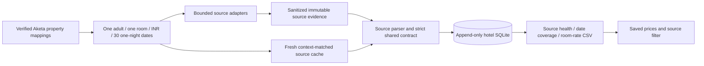

# Aketa OTA pipelines

This rollout is for **Hotel Aketa, Dehradun only**, as requested. It runs locally with Python, Scrapling, Playwright and SQLite. It needs no paid API or AI model at runtime. Other hotel identities and party settings are deliberately not advertised as verified support.

## Source capabilities

| Observation origin | Current capability | Price interpretation |
| --- | --- | --- |
| Google Hotels | Observed one-adult calendar, plus partner displays for the page's actual selected stay | Indicative calendar/partner amounts. Google observations do not become direct Booking.com/MMT/Agoda quotes. |
| Agoda | Observed public room-grid JSON, verified property ID110205, request/response dates, one adult/one room/zero children, and matching individual offer occupancy | Integer displayed nightly amounts before taxes. Meal/payment/cancellation and member/coupon conditions retained. Final checkout totals remain unverified. |
| MakeMyTrip | Verified property ID202108231240265962; saved dated search returned only `200-OK` | No usable quote contract. The adapter reuses that diagnostic without another network request. |
| Booking.com | Identified property URL; live source returned robot-verification challenge | Capture/health adapter only. Exact-stay price parser is not implemented because no usable public response was observed. |
| Expedia | Verified property ID92850456; exact-date search encountered HTTP429, then403 challenge validation | Capture/health adapter only. Exact-stay price parser is not implemented because no usable public response was observed. |

Blocked and missing sources remain gaps. No login, CAPTCHA solving, proxy rotation or booking action is used. A successful HTTP status alone never proves a price or unavailability. The current build does not claim complete direct pricing across all four OTAs.

## Data flow



`source` means where data was observed. `channel` means the displayed supplier. Keep both when Google displays an Agoda or Booking.com offer. Amounts are decimal strings; abbreviated prices retain an approximation and no exact amount. Requested room counts are separate from observed room counts. Exact supplier quote, direct-source displayed price and Google display are distinct price types. Public member/coupon conditions are not a claim that every guest qualifies.

Google needs one calendar capture for the thirty-date window. Direct adapters are designed around one exact stay per capture; a fair queue gives every source its first canary before requesting further dates. The budget counts **capture calls**, not all internal HTTP requests made by a browser. Navigation/direct-request counts supplied by source adapters remain in evidence. Source reads are serial with at least three seconds between starts. This build does not replay opaque OTA endpoints or share sessions across separate OTA captures; that optimization requires a verified reusable request contract.

Each source stops for the run after an empty/unverified/blocked result, avoiding thirty identical failures. Other sources continue. A verified unavailable result is a completed observation for that exact source, stay and party: the planner can continue to later dates without retrying it. Agoda requires an explicit boolean sold-out flag, an empty rooms array and independently matched property/date/party/currency evidence. This does not establish that the hotel is fully booked. Jobs use an exclusive local lock, append each interpretation, and checkpoint after every processed capture. `pause.flag` stops between operations. Resume reparses raw evidence using the current parser; a parser change appends a new interpretation rather than rewriting history. Cache freshness is six hours from the original observation. Keys include the full frozen window and exact stay/party/currency; cross-window reuse is not yet implemented.

## Commands

Run from `C:\Users\astha\CompSetStudio`:

```powershell
.\.venv\Scripts\python.exe -m compset hotels-init
.\.venv\Scripts\python.exe -m compset hotel-run --dashboard
.\.venv\Scripts\python.exe -m compset hotel-status
```

The default run uses saved evidence only. A bounded live/resume job is explicit:

```powershell
.\.venv\Scripts\python.exe -m compset hotel-run --live --sources google_hotels,agoda --request-budget 3 --interval-seconds 3 --dashboard
```

Use the supported sources `google_hotels,makemytrip,booking,expedia,agoda`. Already cached observations cost no capture calls. Sources that previously returned access limits are not automatically retried within the cache window. No recurring job is enabled. A CLI run must finish or pause before another hotel run starts. If a process crashes and leaves `running.lock`, verify its recorded process no longer exists before removing that lock; never clear the lock of a running job.

Import an observed source capture without a network request:

```powershell
.\.venv\Scripts\python.exe -m compset hotel-import --source agoda --file <sanitized-source.json> --start-date 2026-09-28 --checkin 2026-09-28
```

For direct-source imports, `--checkin` selects the exact stay within the thirty-date window. The parser must independently confirm the source request/response and offer occupancy; the command's dates cannot relabel a source. A live window cannot begin in the past.

## Files and dashboard

`data/hotel-pipelines/hotels.json` contains explicit mappings. `evidence.sqlite3` has append-only `hotel_captures`, `hotel_interpretations` and `hotel_jobs` tables, separate from the existing Airbnb/portfolio database. `raw/` preserves sanitized captures, including malformed responses for parser repair. `latest.json`, `rates.csv` and `coverage.csv` expose all source/date cells as quoted, indicative, unavailable or unknown; unrequested dates remain unknown with an explicit reason. Historical SQLite rows remain after refreshes.

`--dashboard` attaches the current source coverage and normalized rates to the existing Hotel Aketa saved-data API. The source filter distinguishes Google from direct OTA evidence; room/meal/tax/payment conditions stay in each row. The previous Google-only report is retained alongside the new pipeline fields. The existing hotel CSV download becomes the combined pipeline rate export. No server restart or new write endpoint is required.

## Repairing changed sources

Keep the failed raw capture and inspect its schema against the last known contract. Discover one ordinary current source response, update the source adapter and regression fixtures, run the relevant tests and independent context/history checks, reparse saved data, then verify a bounded live canary. Hash/schema changes never authorize fabricated prices. Saved source health tells the operator which adapter needs repair and which sources still work.
